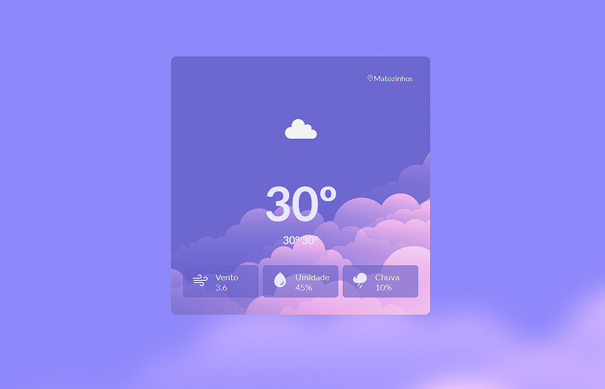

# **Weather Forecast**

## **Descrição**

O projeto Weather Forecast é um aplicativo web que permite ao usuário obter a previsão do tempo para a sua localização atual. Ele exibe informações como temperatura, velocidade do vento, umidade e porcentagem de chance de chuva. Para implementação deste projeto, foram utilizadas as tecnologias React, Styled-components, HTML e CSS. Além disso, as bibliotecas Axios e Phosphor-react foram usadas para fazer as requisições à API do Weather API, que fornece os dados meteorológicos.

## **Funcionalidades**

- Exibe a previsão do tempo para a localização atual do usuário;
- Exibe informações como temperatura, velocidade do vento, umidade e porcentagem de chance de chuva;
- Permite ao usuário atualizar a previsão do tempo.

## **Como executar o projeto**

Para executar o projeto, siga os passos abaixo:

1. Clone o repositório do projeto em sua máquina;
2. Acesse a pasta raiz do projeto;
3. Instale as dependências do projeto utilizando o comando **`npm install`**;
4. Inicie o servidor local utilizando o comando **`npm start`**;
5. Acesse o aplicativo em seu navegador no endereço **`http://localhost:3000/`**.

## **Licença**

Este projeto é licenciado sob a licença MIT. Veja o arquivo LICENSE para mais detalhes.
